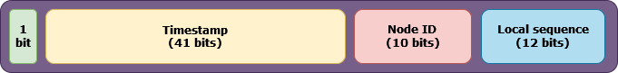

# Distributed Key Generator

This repository contains the implementations of a fast and scalable distributed unique key/id generator.

If we are working with a single instance of an application or database, it is very easy to generate unique keys by
leveraging the auto-increment feature.
We just initialize a value with some offset and a step size. A combination of both can help us generate unique keys.

```
int offset = 0;
int stepSize = 1;
```

This will start from 0 and will create new keys incrementally, i.e., 0, 1, 2, 3, 4, ...

The issue is with this approach is obvious - it works only for single application or database server. It involves
locking and thus, it is not scalable.
What if we need millions of keys per second for popular applications like Twitter, Slack, Chat applications, etc.

Twitter came up with an approach of creating highly scalable system for creating large number of unique, sortable IDs
per second in their implementation of [Snowflake](https://github.com/twitter-archive/snowflake).

Below is the simplified version of the algorithms which Snowflake uses.

## Requirements

### Functional Requirements

1. Keys should be sortable.
2. The keys should not be easily guessable.
3. A key should be 64-bits long.

### Non-Functional Requirements

1. System should be able to generate millions of keys per second
2. The system should be easily scalable in horizontal fashion.

## Working of Snowflake implementation

We will need 64-bits for this implementation. The decomposition of those bits is as below -



### Unused bit

This is one bit and use for future purposes. This bit is set to 0 making the whole id positive.

### Epoch timestamp

This takes 41 bits. The maximum timestamp we can cover with 41 bits is **2<sup>41</sup> - 1** which comes out to be
2199023255551 (Wednesday, September 7, 2039 3:47:35.551 PM).
This gives us approximately 69 years w.r.t. custom epoch.

### Node Id

This takes 10 bits. Thus, we can scale up to **2<sup>10</sup> = 1024** machines horizontally to generate keys.

### Sequence

This is local to a node and of 12 bits. It's maximum value is **2<sup>12</sup> - 1 = 4095**.

First of all, we adjust our timestamp w.r.t. to the custom epoch

```java
long currentTimestamp=Instant.now().toEpochMilli()-DEFAULT_EPOCH;
```

Now, the first 41 bits (after the unused bit) of the ID will be filled with the epoch timestamp. We can achieve this by
using left shift

```java
id = currentTimestamp << (10 + 12)
```

Next, we will take the configured node id (which we will get from the machine's MAC address) and fill the 10 bits.

```java
id |= nodeId << 12
```

Finally, we fill the last 12 bits with the local counter.

```java
id|=sequence
```
